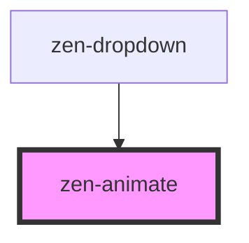

# zen-animate

<!-- Auto Generated Below -->

## Properties

| Property | Attribute | Description                  | Type      | Default |
| -------- | --------- | ---------------------------- | --------- | ------- |
| `show`   | `show`    | Prop that will show the slot | `boolean` | `false` |

## Dependencies

### Used by

 - [zen-dropdown](../zen-dropdown)

### Graph

----------------------------------------------

