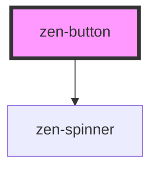

# zen-button

<!-- Auto Generated Below -->

## Properties

| Property   | Attribute  | Description                         | Type                                                                                                                                     | Default                  |
| ---------- | ---------- | ----------------------------------- | ---------------------------------------------------------------------------------------------------------------------------------------- | ------------------------ |
| `disabled` | `disabled` | If present, button will be disabled | `boolean`                                                                                                                                | `false`                  |
| `label`    | `label`    | Label of the button                 | `"Button"`                                                                                                                               | `'Button'`               |
| `loading`  | `loading`  | If present, will show a spinner     | `boolean`                                                                                                                                | `false`                  |
| `variant`  | `variant`  | Color variant of the button         | `ButtonVariants.Destructive \| ButtonVariants.Positive \| ButtonVariants.Primary \| ButtonVariants.Secondary \| ButtonVariants.Tertiary` | `ButtonVariants.Primary` |

## Slots

| Slot             | Description                    |
| ---------------- | ------------------------------ |
| `"leadingIcon"`  | Slot for the icon at the left  |
| `"trailingIcon"` | Slot for the icon at the right |

## Dependencies

### Depends on

- [zen-spinner](../zen-spinner)

### Graph

----------------------------------------------

