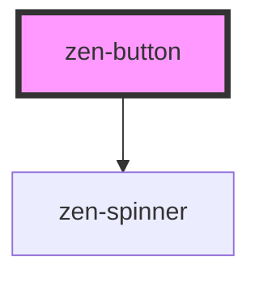

# zen-button

<!-- Auto Generated Below -->

## Properties

| Property   | Attribute  | Description | Type      | Default     |
| ---------- | ---------- | ----------- | --------- | ----------- |
| `disabled` | `disabled` |             | `boolean` | `false`     |
| `label`    | `label`    |             | `string`  | `"Button"`  |
| `loading`  | `loading`  |             | `boolean` | `false`     |
| `variant`  | `variant`  |             | `string`  | `"primary"` |

## Dependencies

### Depends on

- [zen-spinner](../zen-spinner)

### Graph

----------------------------------------------

