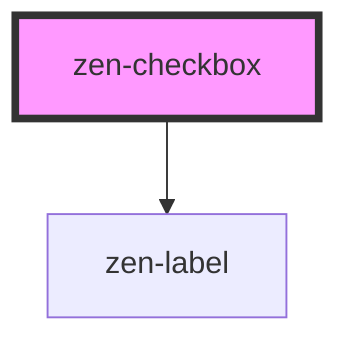

<!-- Auto Generated Below -->

## Properties

| Property   | Attribute  | Description            | Type      | Default |
| ---------- | ---------- | ---------------------- | --------- | ------- |
| `checked`  | `checked`  | Set checked state.     | `boolean` | `false` |
| `disabled` | `disabled` | Disables checkbox.     | `boolean` | `false` |
| `label`    | `label`    | Label of the checkbox. | `string`  | `null`  |

## Events

| Event    | Description                                    | Type                                     |
| -------- | ---------------------------------------------- | ---------------------------------------- |
| `change` | Emitted when the checked property has changed. | `CustomEvent<CheckboxChangeEventDetail>` |

## Dependencies

### Depends on

- [zen-label](../zen-label)

### Graph

----------------------------------------------

