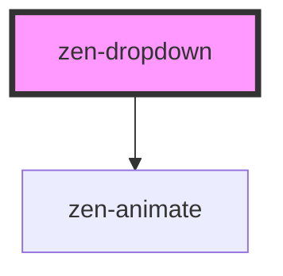

<!-- Auto Generated Below -->

## Properties

| Property        | Attribute        | Description                               | Type           | Default         |
| --------------- | ---------------- | ----------------------------------------- | -------------- | --------------- |
| `multiselect`   | `multiselect`    | If true, multiple options can be selected | `boolean`      | `false`         |
| `options`       | --               | Array of available options                | `OptionItem[]` | `[]`            |
| `selectedColor` | `selected-color` |                                           | `string`       | `undefined`     |
| `trackBy`       | `track-by`       | Option key that is unique for each option | `string`       | `'label'`       |
| `val`           | --               | Selected option                           | `OptionItem`   | `{ label: '' }` |

## Events

| Event    | Description                     | Type                      |
| -------- | ------------------------------- | ------------------------- |
| `input2` | Emitted on any selection change | `CustomEvent<OptionItem>` |

## Dependencies

### Depends on

- [zen-animate](../zen-animate)

### Graph

---
