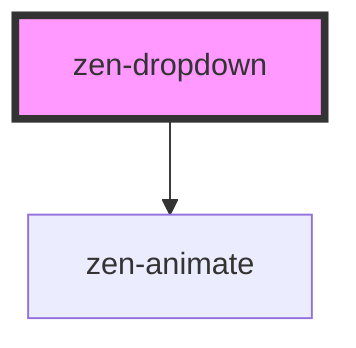

# zen-dropdown

<!-- Auto Generated Below -->

## Properties

| Property      | Attribute     | Description                                              | Type               | Default     |
| ------------- | ------------- | -------------------------------------------------------- | ------------------ | ----------- |
| `menuHeight`  | `menu-height` | To determine if there's enough space under field on open | `number`           | `170`       |
| `multiselect` | `multiselect` | If true, multiple options can be selected                | `boolean`          | `false`     |
| `options`     | --            | Array of available options                               | `OptionItem[]`     | `[]`        |
| `trackBy`     | `track-by`    | Option key that is unique for each option                | `string`           | `'label'`   |
| `value`       | `value`       | Selected option                                          | `number \| string` | `undefined` |

## Events

| Event      | Description                     | Type                            |
| ---------- | ------------------------------- | ------------------------------- |
| `zenInput` | Emitted on any selection change | `CustomEvent<number \| string>` |

## Dependencies

### Depends on

- [zen-animate](../zen-animate)

### Graph

----------------------------------------------

