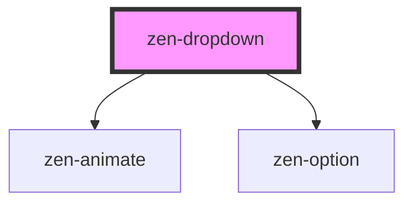

.

<!-- Auto Generated Below -->

## Properties

| Property        | Attribute         | Description                                              | Type                                        | Default      |
| --------------- | ----------------- | -------------------------------------------------------- | ------------------------------------------- | ------------ |
| `borderless`    | `borderless`      | Don't draw border around field                           | `boolean`                                   | `false`      |
| `closeOnSelect` | `close-on-select` | Close dropdown menu after selecting an item              | `boolean`                                   | `true`       |
| `fieldAlign`    | `field-align`     | Alignment of field content and menu (if menuWidth set).  | `Align.CENTER \| Align.LEFT \| Align.RIGHT` | `Align.LEFT` |
| `menuHeight`    | `menu-height`     | To determine if there's enough space under field on open | `number`                                    | `170`        |
| `menuWidth`     | `menu-width`      | Width of menu. Set '100%' to match field width.          | `string`                                    | `'100%'`     |
| `options`       | --                | Array of available options                               | `OptionItem[]`                              | `[]`         |
| `trackBy`       | `track-by`        | Option key that is unique for each option                | `string`                                    | `'label'`    |
| `value`         | `value`           | Selected option                                          | `number \| string`                          | `undefined`  |

## Events

| Event          | Description                            | Type                            |
| -------------- | -------------------------------------- | ------------------------------- |
| `zenFocusItem` | Focused item changed (keyboard arrows) | `CustomEvent<number \| string>` |
| `zenInput`     | Emitted on any selection change        | `CustomEvent<number \| string>` |

## Methods

### `toggle(open?: boolean) => Promise<void>`

Close an opened dropdown menu

#### Returns

Type: `Promise<void>`

## Dependencies

### Depends on

- [zen-animate](../zen-animate)
- [zen-option](../zen-menu-item)

### Graph

----------------------------------------------

