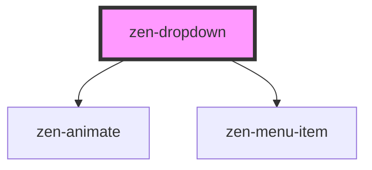

.

<!-- Auto Generated Below -->

## Properties

| Property        | Attribute         | Description                                              | Type               | Default     |
| --------------- | ----------------- | -------------------------------------------------------- | ------------------ | ----------- |
| `closeOnSelect` | `close-on-select` | Close dropdown menu after selecting an item              | `boolean`          | `true`      |
| `menuHeight`    | `menu-height`     | To determine if there's enough space under field on open | `number`           | `170`       |
| `options`       | --                | Array of available options                               | `OptionItem[]`     | `[]`        |
| `trackBy`       | `track-by`        | Option key that is unique for each option                | `string`           | `'label'`   |
| `value`         | `value`           | Selected option                                          | `number \| string` | `undefined` |

## Events

| Event          | Description                            | Type                            |
| -------------- | -------------------------------------- | ------------------------------- |
| `zenFocusItem` | Focused item changed (keyboard arrows) | `CustomEvent<number \| string>` |
| `zenInput`     | Emitted on any selection change        | `CustomEvent<number \| string>` |

## Methods

### `close() => Promise<void>`

Close an opened dropdown menu

#### Returns

Type: `Promise<void>`

## Dependencies

### Depends on

- [zen-animate](../zen-animate)
- [zen-menu-item](../zen-menu-item)

### Graph

----------------------------------------------

