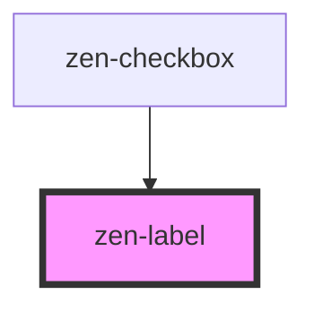

# zen-label

<!-- Auto Generated Below -->

## Properties

| Property   | Attribute  | Description                      | Type      | Default |
| ---------- | ---------- | -------------------------------- | --------- | ------- |
| `label`    | `label`    | Text of the label                | `string`  | `null`  |
| `required` | `required` | Shows a red asterisk after label | `boolean` | `false` |

## Dependencies

### Used by

 - [zen-checkbox](../zen-checkbox)

### Graph

----------------------------------------------

