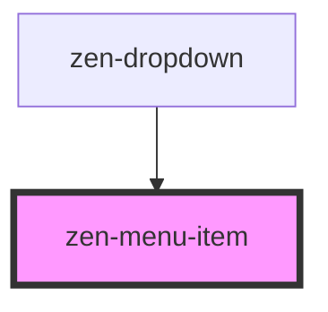

<!-- Auto Generated Below -->

## Properties

| Property         | Attribute         | Description                         | Type      | Default  |
| ---------------- | ----------------- | ----------------------------------- | --------- | -------- |
| `defaultPadding` | `default-padding` | False to enable custom item padding | `boolean` | `true`   |
| `focused`        | `focused`         | Render item as focused              | `boolean` | `false`  |
| `label`          | `label`           | Text inside the item                | `string`  | `'Item'` |
| `selected`       | `selected`        | Render item as selected             | `boolean` | `false`  |

## Dependencies

### Used by

 - [zen-dropdown](../zen-dropdown)

### Graph

----------------------------------------------

