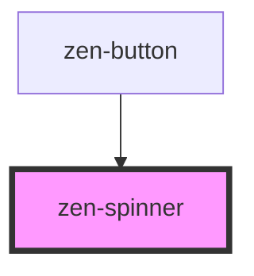

# zen-spinner

<!-- Auto Generated Below -->

## Properties

| Property | Attribute | Description                                              | Type     | Default |
| -------- | --------- | -------------------------------------------------------- | -------- | ------- |
| `color`  | `color`   | Color of the spinner. Accepts any CSS Legal Color Value. | `string` | `null`  |

## Dependencies

### Used by

 - [zen-button](../zen-button)

### Graph

----------------------------------------------

