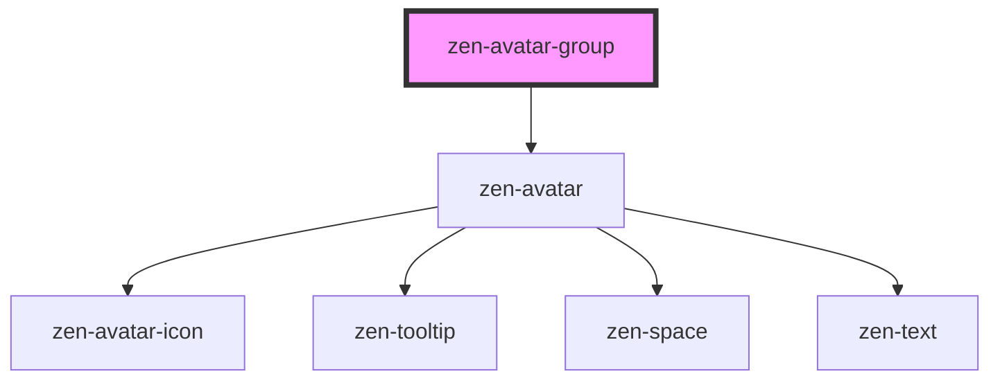

# zen-avatar-group

<!-- Auto Generated Below -->

## Properties

| Property     | Attribute     | Description                    | Type       | Default |
| ------------ | ------------- | ------------------------------ | ---------- | ------- |
| `displayMax` | `display-max` | Max number of users to display | `number`   | `4`     |
| `users`      | --            | Array of user's data           | `Avatar[]` | `[]`    |

## Dependencies

### Depends on

- [zen-avatar](../../components/zen-avatar)

### Graph

----------------------------------------------

