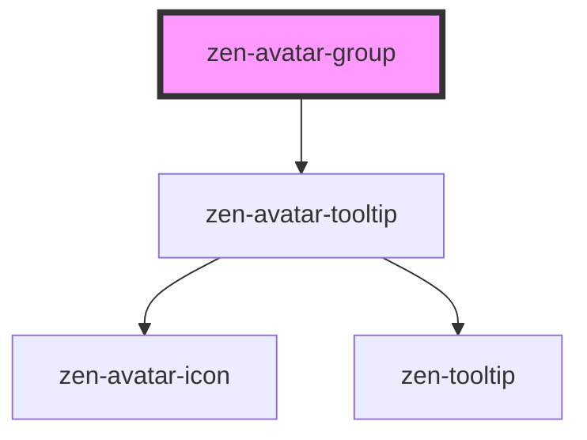

# zen-avatar-group

<!-- Auto Generated Below -->

## Properties

| Property     | Attribute     | Description     | Type       | Default |
| ------------ | ------------- | --------------- | ---------- | ------- |
| `displayMax` | `display-max` | User to display | `number`   | `4`     |
| `users`      | --            | Users           | `Avatar[]` | `[]`    |

## Dependencies

### Depends on

- [zen-avatar-tooltip](../../components/zen-avatar-tooltip)

### Graph

----------------------------------------------

