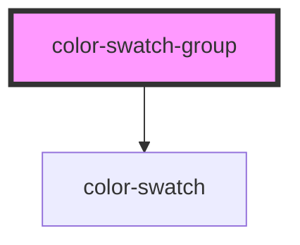

# color-swatch-group

<!-- Auto Generated Below -->

## Properties

| Property | Attribute | Description     | Type     | Default |
| -------- | --------- | --------------- | -------- | ------- |
| `colors` | `colors`  | Array of colors | `string` | `'[]'`  |

## Dependencies

### Depends on

- [color-swatch](../color-swatch)

### Graph

----------------------------------------------

