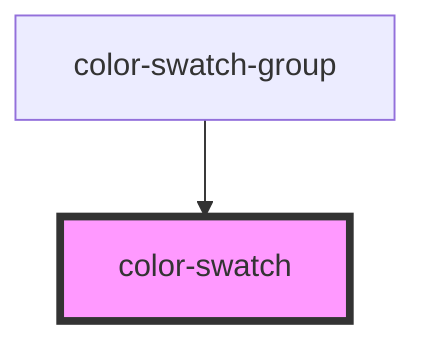

<!-- Auto Generated Below -->

## Properties

| Property        | Attribute         | Description                        | Type      | Default          |
| --------------- | ----------------- | ---------------------------------- | --------- | ---------------- |
| `color`         | `color`           |                                    | `string`  | `'#ffffff'`      |
| `isBrightColor` | `is-bright-color` | True if color is considered bright | `boolean` | `false`          |
| `varName`       | `var-name`        |                                    | `string`  | `'$color-white'` |

## Dependencies

### Used by

 - [color-swatch-group](../color-swatch-group)

### Graph

----------------------------------------------

