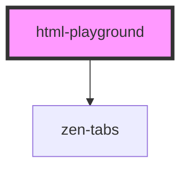

# docs-table

<!-- Auto Generated Below -->

## Properties

| Property    | Attribute    | Description                                                | Type      | Default                                                           |
| ----------- | ------------ | ---------------------------------------------------------- | --------- | ----------------------------------------------------------------- |
| `html`      | `html`       | html source code to preview                                | `string`  | `'<zen-button label="My button" variant="primary"></zen-button>'` |
| `saveValue` | `save-value` | Save current value to local storage and restore it on load | `boolean` | `true`                                                            |

## Dependencies

### Depends on

- [zen-tabs](../../../components/zen-tabs)

### Graph

----------------------------------------------

