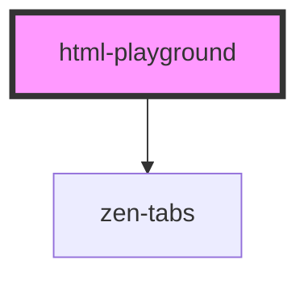

# docs-table

<!-- Auto Generated Below -->

## Properties

| Property            | Attribute            | Description                                                | Type          | Default                    |
| ------------------- | -------------------- | ---------------------------------------------------------- | ------------- | -------------------------- |
| `saveValue`         | `save-value`         | Save current value to local storage and restore it on load | `boolean`     | `true`                     |
| `selectedFramework` | `selected-framework` | What framework is initally selected                        | `string`      | `this.frameworks[0].value` |
| `sourceCodes`       | --                   | What framework is initally selected                        | `SourceCodes` | `DEFAULTS_SOURCES()`       |

## Dependencies

### Depends on

- [zen-tabs](../../../components/zen-tabs)

### Graph

----------------------------------------------

